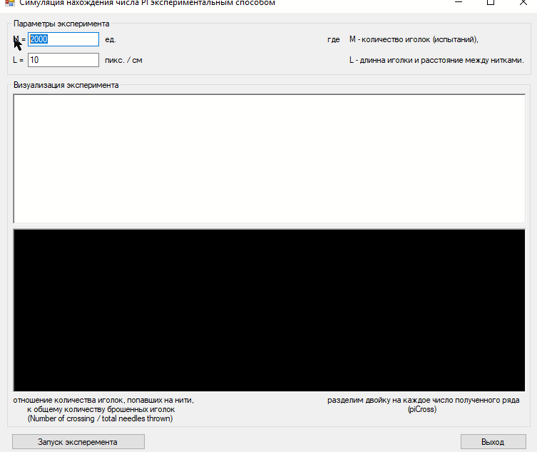

# Thread, Needle & Pi

This repository is the implementation of a term paper for a familiar girl who asked for help. I was young, stupid, I was a cheerful student, and I did anything. Therefore, I ask you not to judge strictly.

## Result

Here is a demonstration of how an application works:

When creating this repository, the application is tested and compiled into Visual Studio 2017 (with platform toolset v141)

## References

Based on the [article with Habrhabr](https://habr.com/post/172827/) from the user [@mephistopheies](https://habr.com/users/mephistopheies/)
